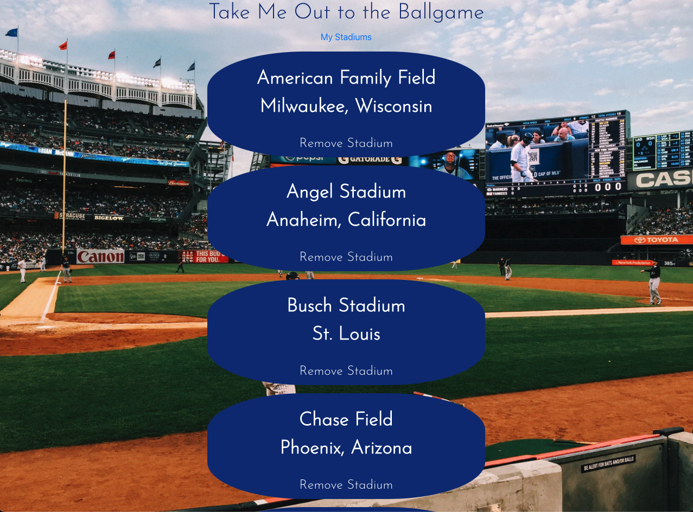

# Take Me Out to the Ballgame 

Track all of the Major League Baseball stadiums you have been to!

## Features
- Lets users see a list of all active MLB stadiums
- Users can click on a stadium to add it to their personal "My Stadiums" list, which tracks all stadiums they have visited

## Technologies Used
- React
- JavaScript
- CSS
- NodeJS
- Express
- Bootstrap
- MongoDB (database)
- Netlify (for deployment)

## Screenshots

## Future Improvements
- Add a login feature to track for individual users
- Display a picture of each stadium
- Show current weather data for each stadium

##  ➡️ Check It Out!
[Click here](https://caseymacleod-stadium-tracker.herokuapp.com/) to go to the site!

